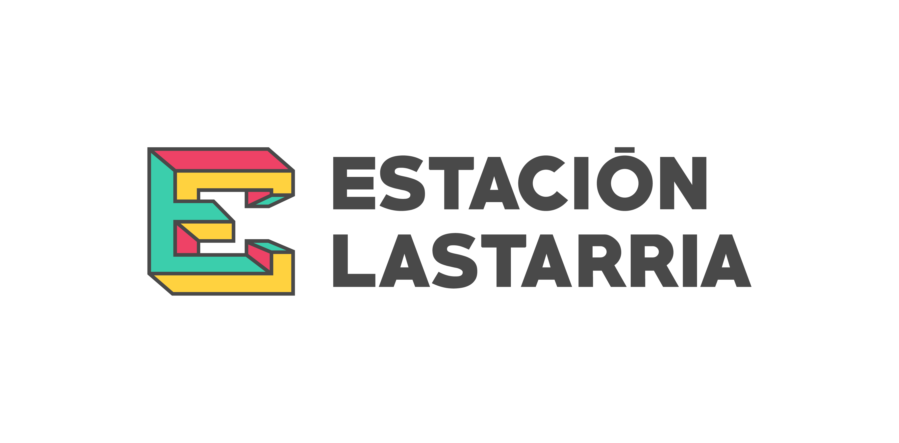

# Estadística básica e introducción a {tidyverse}

#### Sara Acevedo, 2022

#### Estación Lastarria

## Descripción del curso

Este curso de 5 sesiones aborda conceptos de estadística y ciencias de
datos usando el lenguaje de programación R y el megapaquete Tidyverse.
Aprenderás a utilizar funciones para administrar, analizar y visualizar
datos de forma reproducible y fácil de comunicar.

## Objetivos del curso

Usando dataframes de distintos tipos (data de ecología y ciencias
sociales), el curso se enfoca en:

-   Manejar de forma general las herramientas más usadas en análisis
    exploratorio de datos
-   Contruir datasets informativos y reproducibles con datos limpios
-   Comunicar las hipótesis generadas por los datos por medio de
    visualizaciones y reportes

## Metodología

-   Clases expositivas
-   Entrega de material en RMarkdown
-   Ejercicios a resolver en RMarkdown
-   Clases de 2 horas de duración

## Programación

| Sesión        | Contenidos         | Fecha   |
| ------------- |:-------------:| -----:|
| Comprender los elementos básicos del lenguaje de programación R (1/2) | <ul><li>item1</li><li>item2</li></ul> | TBA |
| Comprender los elementos básicos del lenguaje de programación R (1/2) | <ul><li>item1</li><li>item2</li></ul> | TBA |
| zebra stripes | <ul><li>item1</li><li>item2</li></ul>      | TBA |
| zebra stripes | <ul><li>item1</li><li>item2</li></ul>     | TBA |
| <ul><li>item1</li><li>item2</li></ul>| <ul><li>item1</li><li>item2</li></ul> | TBA |

## Responsable

**Sara Acevedo** Estudiante Doctorado Ciencias de la Ingeniería UC. MSc.
Soil and Biogeochemistry UCDavis. Químico UC.

## Requerimientos

-   Ganas de aprender y tolerancia a la frustración
-   Inglés básico-intermedio
-   Computador con RStudio y R instalado

## Bibliografía

-   [R for Data Science, Hadley Wickham y Garrett
    Grolemund](https://es.r4ds.hadley.nz/)
-   [Introduction to Environmental Data Science,Jerry Davis, SFSU
    Institute for Geographic Information
    Science](https://bookdown.org/igisc/EnvDataSci/%5D)
-   [RStudio
    Cheatsheets](https://www.rstudio.com/resources/cheatsheets/)
-   [A ModernDive into R and the
    Tidyverse](https://moderndive.com/index.html)
