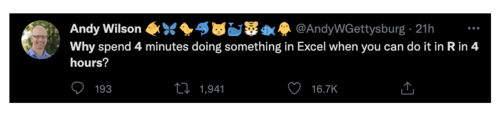

class: center, middle  

```{r xaringan-themer, include=FALSE, warning=FALSE}
library(xaringanthemer)
library(tidyverse)

style_mono_accent(base_color = "#8B9F84",
                  inverse_link_color = "white")

xaringanExtra::use_panelset()
xaringanExtra::use_clipboard()
```

```{r,echo=FALSE}
countdown::countdown(minutes = 5)
```


# bienvenidos!!
.center[Mi nombre es Sara Acevedo, y el tuyo?]
[`r icons::fontawesome("link")` saryace.github.io](https://biofisica.ing.puc.cl)
[`r icons::fontawesome("twitter")` @saryace](https://twitter.com/soilbiophysics1)


---

.center[# bienvenidos 🐸]

```{r}
saludo_curso <- function(nombre) {
  paste("hola", nombre)
}

nombres_clase <- c("Felipe",  "Pedro",  "Victo" , "Ximena",
                    "Olivier",  "Valentina")
for (estudiantes in nombres_clase) {
  print(saludo_curso(estudiantes))
}

```
---

## Qué veremos hoy?

* Importancia de la reproducibilidad de los datos e información
* Buenas prácticas
* Qué es tidyverse
* Familiarizarse con el IDE RStudio
* Conocer operadores y funciones 

---

class: center middle
.center[]

@AndyWGettysburg: Porqué hacer algo en 4 minutos en Excel si puedes hacerlo en 4 horas en R?

```{r,echo=FALSE}
countdown::countdown(minutes = 2)
```

---

class: center middle inverse

Un análisis de datos es *reproducible* si toda la información (datos, archivos, etc.) necesaria está disponible para que otra persona pueda rehacer su análisis completo. 

.footnote[
[1] Capítulo 5 de [R programming for research](https://geanders.github.io/RProgrammingForResearch/reproducible-research-1.html)
]

---

## Análisis exploratorio de datos (AED)

.center[]

.footnote[
[1] [Figura R4DS](https://r4ds.had.co.nz/explore-intro.html)

[2] [Capítulo en español R4DS](https://es.r4ds.hadley.nz/introducci%C3%B3n.html) 
]

---

## Esto se cumple si están disponibles:

* Los datos (en bruto)

--

* El código para limpiar los datos desde datos en bruto 

--

* El código y software para el análisis 

.footnote[
[1] Capítulo 5 de [R programming for research](https://geanders.github.io/RProgrammingForResearch/reproducible-research-1.html)
]

---
## Pasos necesarios para asegurar reproducibilidad

* Todos los datos brutos deben guardarse en el directorio del proyecto 
* Se debe detallar la fuente de todos estos datos
* Deben incluirse scripts con todo el código utilizado para limpiar y crear las figuras y tablas
* Debe incluir detalles sobre las versiones del software utilizado (para R, esto incluye la versión de R así como las versiones de todos los paquetes utilizados)
* En la medida de lo posible, no debe haber pasos "a mano"

.footnote[
[1] Capítulo 5 de [R programming for research](https://geanders.github.io/RProgrammingForResearch/reproducible-research-1.html)
]

---

class: center middle inverse
.right[usando R + tidyverse aprenderemos herramientas para ciencia de datos reproducible]

---

## Buenas prácticas (algunas importantes)

* Nombrar **cosas** apropiadamente
* **DRY** — Don’t Repeat Yourself
* Comentar **infinitamente**
* Usar **proyectos** para organizar datos y scripts
* Ver [`r icons::fontawesome("link")` otras acá](https://waterdata.usgs.gov/blog/intro-best-practices/) 

---

class: middle, inverse

.center[##Buena práctica: nombrar **cosas** apropiadamente]

# Tres principios 

--

### Leíbles para el computador 💻

--

### Leíbles para los humanos 👫

--

### Pueden ser ordenados sin problemas 🗂️

---

.center[## Cual prefieres?]

.pull-left[
- miresu.docx

- presupuestoFinal.pdf

- figura 3barra.png
]

.pull-right[
- 2022-03-03_resumen-congreso-internacional.docx

- 2022-03-03_semestral_presupuesto-auditado.pdf

- 03_figura-barras-presupuesto.png
]

.footnote[
[1] [Naming things - Jenny Brian](http://www2.stat.duke.edu/~rcs46/lectures_2015/01-markdown-git/slides/naming-slides/naming-slides.pdf)
]

---

.center[## Cual prefieres?]

```{r}
d <- 100
t <- 50

v = d / t

v

```

```{r}

distancia <- 100 #metros
tiempo <- 50 #segundos

velocidad = distancia / tiempo

velocidad # en metros/segundo

```

---
class: middle, inverse

### Leíbles para el computador 💻

--

evitar los espacios, la puntuación, los caracteres acentuados, la distinción entre mayúsculas y minúsculas

--

uso deliberado de delimitadores (_ y -)


---

class: middle, inverse

### Leíbles para los humanos 👫

--

el nombre contiene información sobre el contenido

--

conecta con el concepto de slug de [URL semánticas](https://es.wikipedia.org/wiki/URL_sem%C3%A1ntica)

---

class: middle, inverse

### Pueden ser ordenados sin problemas 🗂️

--

poner algo numérico primero

--

utilizar la norma ISO 8601 para las fechas (YYYY-MM-DD)

--

rellenar otros números con ceros a la izquierda
---

.center[## Ejemplo 1]

.pull-left[
- Tengo varios archivos de encuestas

- Diferentes fechas
]

.pull-right[
- 2022-03-03_encuesta_nacional_tipo-A.csv

- 2022-03-03_encuesta_nacional_tipo-B.csv

- 2022-06-03_encuesta_regional_tipo-A.csv

]

.footnote[
[1] [Naming things - Jenny Brian](http://www2.stat.duke.edu/~rcs46/lectures_2015/01-markdown-git/slides/naming-slides/naming-slides.pdf)
]

---
.center[## Ejemplo 1]

.pull-left[
- Tengo varios archivos de encuestas

- Diferentes fechas
]

.pull-right[
- **2022-03-03** _encuesta-nacional_tipo-A.csv

- 2022-03-03_ **encuesta-nacional** _tipo-B.csv

- 2022-06-03_encuesta_regional_ **tipo-A** .csv
]

.footnote[
[1] [Naming things - Jenny Brian](http://www2.stat.duke.edu/~rcs46/lectures_2015/01-markdown-git/slides/naming-slides/naming-slides.pdf)
]

---

.center[## Ejemplo 2]

.pull-left[
- Tengo varios scripts con mi análisis reproducible

- Tengo mis datos brutos
]

.pull-right[
- scripts/01_cargar-librerias.R

- scripts/02_cargar-datos-brutos.R

- scripts/03_limpiar-datos-brutos.R

- datos/2022-03-03_encuesta-nacional_tipo-A_bruto.csv

]

.footnote[
[1] [Naming things - Jenny Brian](http://www2.stat.duke.edu/~rcs46/lectures_2015/01-markdown-git/slides/naming-slides/naming-slides.pdf)
]

---

class: middle, inverse

.center[##Buena práctica: DRY Don’t Repeat Yourself]

---

```{r}
paste("hola","Felipe")
paste("hola","Pedro")
paste("hola","Victo")
paste("hola","Ximena")
paste("hola","Olivier")
paste("hola","Valentina")
```
---

```{r}
saludo_curso <- function(nombre) {
  paste("hola", nombre)
}

nombres_clase <- c("Felipe",  "Pedro",  "Victo" , "Ximena",
                    "Olivier",  "Valentina")
for (estudiantes in nombres_clase) {
  print(saludo_curso(estudiantes))
}

```

> Qué es mejor con 50 alumnos?

---

class: middle, inverse

.center[##Buena práctica:  comentar infinitamente]

---

# Comentarios
En RStudio, el shortcut es Ctrl + Shift + C (Command + Shift + C en macOS) para comentar
```{r, fig.align = "center",fig.width=10, fig.height=2, fig.fullwidth=TRUE}
library(ggkeyboard)
ggkeyboard() %>%
  highlight_keys(c("Ctrl Left",
                   "Shift Left",
                   "C"))
```
---
# Comentarios
En RStudio, el shortcut para breaks es Ctrl + Shift + R (Command + Shift + R en macOS) 
```{r, fig.align = "center",fig.width=10, fig.height=2, fig.fullwidth=TRUE}
# libreria ----------------------------------------------------------------
library(ggkeyboard)

# codigo teclado ----------------------------------------------------------
ggkeyboard() %>%
  highlight_keys(c("Ctrl Left",
                   "Shift Left",
                   "R"))
```
---
```{r, fig.align = "center",fig.width=12, fig.height=4, fig.fullwidth=TRUE}
# libreria ----------------------------------------------------------------
library(ggkeyboard) #libreria: https://github.com/sharlagelfand/ggkeyboard
# codigo teclado ----------------------------------------------------------
ggkeyboard() %>% # teclado por defecto
  highlight_keys(c("Ctrl Left",
                   "Shift Left",
                   "C")) #funcion para destacar teclas
```
---

class: middle, inverse

.center[##Buena práctica: Usar proyectos para organizar datos y scripts]

---
class: left inverse
background-image: url("01_figures/01_rproject.png")
background-size: contain
---
class: left inverse
background-image: url("01_figures/02_rproject.png")
background-size: contain
---
class: left inverse
background-image: url("01_figures/03_rproject.png")
background-size: contain
---
class: left inverse
background-image: url("01_figures/04_rproject.png")
background-size: contain
---

class: bottom center inverse
background-image: url("01_figures/tidyverse.png")
background-size: cover
# qué es tidyverse?

---

class: center middle 

#descanzemos de la pantalla por 10 minutos 🐸

```{r,echo=FALSE}
countdown::countdown(minutes = 10)
```

---

class: bottom center inverse
background-image: url("01_figures/tidyverse.png")
background-size: cover
# qué es tidyverse?

---

## Tidyverse: 

* Megapaquete que contiene paquetes para el análisis datos
* Construidos con los mismos principios

## La filosofía del paquete

* Reusar estructuras de datos
* Utilizar el operador `pipe %>% ` para combinar funciones
* Pensado para "humanos"

---

# `pipe %>% ` shortcut 
```{r, fig.align = "center",fig.width=10, fig.height=4, fig.fullwidth=TRUE, echo=F}
library(ggkeyboard) #libreria: https://github.com/sharlagelfand/ggkeyboard
ggkeyboard() %>% # teclado por defecto
  highlight_keys(c("Ctrl Left",
                   "Shift Left",
                   "M")) #funcion para destacar teclas
```
---

.center[### Ejemplo: un pedazo de torta a partir de ingredientes]

--

- Ingredientes (harina, azúcar, etc.) 🛒

--

- Mezclar en un bowl ingredientes 🥣

--

- Hornear la mezcla ⏲️

--

- Decorar el bizcocho 🥧

--

- Cortar 🍰

.footnote[
[1] Idea de Arthur Welles [@ArthurWelle](https://twitter.com/ArthurWelle)
]
---
.center[### Ejemplo: un pedazo de torta a partir de ingredientes]

Estilo no-tidyverse

Al igual que con las matemáticas, el orden en que se evalúan las funciones se mueve desde el conjunto interior de paréntesis hasta el exterior 

```{r, eval=FALSE}

torta <- decorar(hornear(mezclar(ingredientes)))

pedazo_torta <- cortar(torta)

```

Estilo tidyverse
```{r, eval=FALSE}
pedazo_torta <-
  ingredientes %>%
  mezclar() %>%
  hornear() %>%
  decorar() %>%
  cortar()

```
.footnote[
[1] Idea de Arthur Welles [@ArthurWelle](https://twitter.com/ArthurWelle)
]

---
class: center middle inverse
.right[miremos RStudio y revisemos sus componentes 💻]

---

class: middle right inverse
background-image: url("01_figures/rstudio_screenshot.png")
background-size: contain
- ### [Environment]

--

- ### Acá están los objetos e historial

---

class: bottom right inverse
background-image: url("01_figures/rstudio_screenshot.png")
background-size: contain

- ### [Files/Plots/Packages/Help/Viewer]

--

- ### Acceso al directorio, archivos, ayuda, etc.

---

class: bottom left inverse
background-image: url("01_figures/rstudio_screenshot.png")
background-size: contain

- ### Consola: 

--

- ### donde el código desde source se evalua

--

- ### Util para operaciones rápidas

---

class: left inverse
background-image: url("01_figures/rstudio_screenshot.png")
background-size: contain

- ### Source: 

--

- ### Donde se escriben los scripts

--

- ### Se ejecuta con ´run´

---

class: center middle inverse

.center[#funciones y operadores]

---

# funciones

Una ´function call´ forma una expresión en R, y la salida (output) será el resultado de ejecutar ´print()´ o ´View()´ al objeto al que da salida

ejemplo tipo de funciones en tidyverse
```{r, eval=FALSE}

function_name(formal_argument_1 = named_argument_1, 
              formal_argument_2 = named_argument_2,
              [etc.])
```

ejemplo: 
```{r}

uno_al_diez <- 1:10 # operador : significa desde x a y número entero

uno_al_diez

```

```{r}
glimpse(uno_al_diez) # glimpse resume los datos, e indica el tipo

```
---

# operadores
Los operadores son símbolos que le indican a R que debe realizar una tarea. Combinando datos + operadores + funciones R hace su trabajo. Los hay:

* Asignación
* Aritméticos
* Relacionales
* Lógicos


.footnote[
[1] Capítulo 5 Operadores [R para principiantes](https://bookdown.org/jboscomendoza/r-principiantes4/operadores.html)
]

---

# Asignación

|  Operador | Operación  |
|---|---|
|   `<-` | Asigna un valor a una variable  |
|   `=` | Asigna un valor a una variable  |

```{r}

uno_al_diez <- 1:10 

one_to_ten = 1:10

```

---

## Aritméticos

|  Operador | Operación  |
|---|---|
|   `+` | Suma    |
|   `-` | Resta   |
|   `*` | Multiplicación    |
|   `/` | División    |
|   `^` | Potencia    |
|  `%%` | División entera |

```{r}

uno_al_diez * 10

```

> abre RStudio y prueba una operación matemática en la consola

---

## Relacionales

|  Operador | Operación  |
|---|---|
|   `<` | Menor que  |
|   `<=` | Menor o igual que   |
|   `>` | Mayor o igual que |
|   `>=` | División    |
|   `==` | Exactamente igual que |
|  `!=` | No es igual que |

```{r}

uno_al_diez == one_to_ten

```

> abre RStudio y prueba una operación relacional en la consola

---

# Lógicos

|  Operador | Operación  |
|---|---|
<<<<<<< HEAD
| x &#x7c; y | x Ó y es verdadero  |
=======
|   x &#x7c; y | x Ó y es verdadero  |
>>>>>>> main
|   x & y | x Y y son verdaderos   |
|   !x | x no es verdadero (negación) |
|   isTRUE(x) | x es verdadero (afirmación) |

```{r, eval = FALSE}

ingredientes %>% 
  mezclar(harina & ázucar)

```

> estos operadores los usaremos un poco más adelante

---

class: center inverse
## Qué podemos hacer con tidyverse?

```{r fig.show='hide'}
library(guaguas)
library(tidyverse)
guaguas %>% 
  filter(nombre == "Brian" | nombre == "Kevin") %>% 
  ggplot(aes(anio, n, color = fct_reorder2(nombre, n, anio))) + 
  geom_line() +
  labs(x = "año", y = "total inscripciones", color = "nombre",
       title = "El efecto 'Backstreet Boys'") +
  theme_bw()
```

.footnote[
[1] [Paquete R guaguas por Riva Quiroga](https://github.com/rivaquiroga/guaguas)

[2] Código adaptado de repositorio
]

---

class: center inverse
## Qué podemos hacer con tidyverse?

```{r echo = FALSE}
library(guaguas)
library(tidyverse)
guaguas %>% 
  filter(nombre == "Brian" | nombre == "Kevin") %>% 
  ggplot(aes(anio, n, color = fct_reorder2(nombre, n, anio))) + 
  geom_line() +
  labs(x = "año", y = "total inscripciones", color = "nombre",
       title = "El efecto 'Backstreet Boys'") +
  theme_bw()
```

---

# Para terminar por hoy, algo divertido

instala el siguiente paquete
```{r, eval = FALSE}
install.packages("beepr")
```
luego de instalado, corre el siguiente código en la consola
```{r, eval = FALSE}
library(beepr)
beep(2)
```

---

class: center middle inverse

## Nos vemos la próxima semana 🐸
<<<<<<< HEAD
=======

>>>>>>> main
