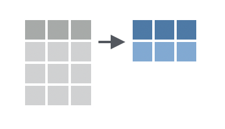

class: center, middle  

```{r xaringan-themer, include=FALSE, warning=FALSE}
library(xaringanthemer)
library(knitr)
library(tidyverse)

style_mono_accent(base_color = "#8B9F84",
                  inverse_link_color = "white")

xaringanExtra::use_panelset()
xaringanExtra::use_clipboard()
```

# bienvenidos!!
.center[Segunda clase de introdución a tidyverse]
[`r icons::fontawesome("link")` saryace.github.io](https://saryace.github.io)
[`r icons::fontawesome("twitter")` @saryace](https://twitter.com/saryace)


---

### Qué vimos la clase anterior?

* Importancia de la reproducibilidad de los datos e información
* Buenas prácticas

.center[]

@AndyWGettysburg: Porqué hacer algo en 4 minutos en Excel si puedes hacerlo en 4 horas en R?

---
class: left inverse
background-image: url("02_figures/code_last_year.jpeg")
background-size: contain


.footnote[
[1] [Foto de @Jas_Hughes dueña del gatito](https://twitter.com/Jas_Hughes/status/1428442201403449350?fbclid=IwAR14COm1R2PbMKFRa12ISEpRojQ14hwsHLXI17MxukR-w8XV9b4wJkPxaWY)
]


---

### Análisis exploratorio de datos (AED)

.center[]

* Qué es tidyverse
* Familiarizarse con el IDE RStudio
* Conocer operadores y funciones 

.footnote[
[1] [Figura R4DS](https://r4ds.had.co.nz/explore-intro.html)

[2] [Capítulo en español R4DS](https://es.r4ds.hadley.nz/introducci%C3%B3n.html) 
]

---

### Preguntas de la clase anterior

* Otros megapaquetes en R?
  * Tidymodels: una colección de paquetes para la modelización y el aprendizaje automático utilizando los principios de tidyverse
  * RsquaredAcademy: plataforma educativa
  * Análisis de pedigri : patrón de herencia de un rasgo particular a lo largo de una familia

.footnote[
[1] [tidymodels](https://www.tidymodels.org/)
[2] [RsquaredAcademy](https://www.rsquaredacademy.com/)
[3] [The ped suite](https://magnusdv.github.io/pedsuite/)
]

---

### Preguntas de la clase anterior

* Asignación
  * Asignar datos a una variable
  * Después de realizar la operación de asignación, podemos usar el nombre de la variable para realizar operaciones con ella
  * Si asignamos un valor a una variable a la que ya habíamos asignado datos, nuestra variable conserva el valor más reciente
  * Asignar permite “guardar” el resultado de operaciones en la consola
  
.footnote[
[1] Capítulo 5.4 [R para principiantes](https://bookdown.org/jboscomendoza/r-principiantes4/operadores-de-asignacion.html)
]

---

### Preguntas de la clase anterior: asignación

```{r}

distancia <- 100 #metros
tiempo <- 50 #segundos

velocidad = distancia / tiempo

velocidad # en metros/segundo

tiempo <- 25 #segundos

velocidad # en metros/segundo

velocidad = distancia / tiempo

velocidad # en metros/segundo

```

---

class: center middle inverse
.right[Clase de hoy: importar datos + primeras funciones + estadisticas básicas]

---

class: left inverse
background-image: url("02_figures/plot_tidytuesday.png")
background-size: contain

.footnote[
[1] Rebecca Stevick [20210420_NetflixTitles](https://github.com/rjstevick/TidyTuesday/tree/master/2021/20210420_NetflixTitles)
]

---

### Objetivos clase hoy

* Aprender a importar datos
* Entender los datos (tipos y estructuras)
* Revisar si los datos estan limpios
* Aplicar funciones para obtener información (estadísticas básicas)

---

### Importar datos 

.pull-left[
El objetivo de readr es proporcionar una forma rápida y amigable de leer datos *rectangulares* de archivos delimitados, como valores separados por comas (CSV) y valores separados por tabulaciones (TSV).
]

.pull-right[

]

.footnote[
[1] Documentacion [readr](https://readr.tidyverse.org/)
]

---

.pull-left[
- *readxl* facilita la extracción de datos de Excel y su uso en R.
- *googlesheets4* proporciona una interfaz de R para Google Sheets a través de Sheets API
- NOTA: hay que cargar ambos explícitamente, porque no es cargado a través de library(tidyverse)
]

.pull-right[


]

.footnote[
[1] Documentacion [readr](https://readr.tidyverse.org/)
]

---

class: center middle inverse

.center[### Revisemos la documentación de readr
[readr](https://readr.tidyverse.org/)]

---

### Datos tidy rectangulares (ordenados)

* Cada variable forma su propia columna
* Cada observación forma una fila
* Y cada celda es un único valor


.footnote[
[1] R4DS [tidy data](https://r4ds.had.co.nz/tidy-data.html)
]

---

class: center middle inverse

.center[### tipos y estructuras de datos]

---

### Clases de datos en R (atomic)

* logical (e.g., `TRUE`, `FALSE`)
* integer (e.g, `2L`, `as.integer(3)`)
* numeric (real, double) (e.g, `2`, `2.0`, `pi`)
* complex (e.g, 1 + 0i, 1 + 4i)
* character (e.g, `"a"`, `"swc"`)

```{r}
uno_al_diez <- 1:10

uno_al_diez

typeof(uno_al_diez)

```

---

### Clases de datos en R (atomic)

* logical (e.g., `TRUE`, `FALSE`)
* integer (e.g, `2L`, `3`)
* numeric (real, double) (e.g, `2`, `2.0`, `pi`)
* complex (e.g, 1 + 0i, 1 + 4i)
* character (e.g, `"a"`, `"swc"`)

```{r}

uno_al_diez_multiplicado <- uno_al_diez * 0.75

uno_al_diez_multiplicado

typeof(uno_al_diez_multiplicado)

```

---

### Clases de datos en R (atomic)

* logical (e.g., `TRUE`, `FALSE`)
* integer (e.g, `2L`, `3`)
* numeric (real, double) (e.g, `2`, `2.0`, `pi`)
* complex (e.g, 1 + 0i, 1 + 4i)
* character (e.g, `"a"`, `"swc"`)

```{r}

uno_al_diez == 1:10

uno_al_diez_multiplicado == 1:10

```

---

### Clases de datos en R (atomic)

* logical (e.g., `TRUE`, `FALSE`)
* integer (e.g, `2L`, `3`)
* numeric (real, double) (e.g, `2`, `2.0`, `pi`)
* complex (e.g, 1 + 0i, 1 + 4i)
* character (e.g, `"a"`, `"swc"`)

```{r}

uno_al_diez_pan <- paste("quiero", uno_al_diez_multiplicado, "panes")

uno_al_diez_pan

typeof(uno_al_diez_pan)

```
---


### conversión de tipos de datos

* `as.integer`, `as.character`, `as.numeric`

```{r}

uno_al_diez_multiplicado_enteros <-  
  as.integer(uno_al_diez_multiplicado)

uno_al_diez_multiplicado_enteros

typeof(uno_al_diez_multiplicado_enteros)

```

---

### Estructuras de datos en R

* *vector* un vector es una colección de uno o más datos del mismo tipo
* list 
* matrix
* data frame
* tibble (tidyverse)

```{r}

is.vector(uno_al_diez)

```

```{r}

mis_perros <- c("pepito", "cuchito", "cachupin") # funcion c()

is.vector(mis_perros)

str(mis_perros)

```
---

### Estructuras de datos en R

* vector
* *list* elementos que puede ser de diferente tipo o incluso de diferente clase
* matrix
* data frame
* tibble (tidyverse)

```{r}

mi_mascota_fav <- list("nombre" = "pepito",
                   "tiene pulgas" = TRUE,
                   "edad" = 9)

is.vector(mi_mascota_fav) # las list son vectores también

str(mi_mascota_fav)

```

---

### Estructuras de datos en R

* vector
* list
* *matrix*  pueden contener datos de un sólo tipo, pero además de largo, tienen más dimensiones
* data frame
* tibble (tidyverse)

```{r}

matriz_ejemplo <- matrix(1:12, nrow = 3, ncol = 3)

matriz_ejemplo

```

---

### Estructuras de datos en R

* vector
* list
* matrix  
* *data frame* estructuras dos dimensiones (rectangulares) que pueden contener datos de diferentes tipos
* *tibble (tidyverse)* es un data frame, pero modificando algunas características para hacer la vida más fácil

```{r}

mis_mascotas_df <- data.frame(
  "nombre" = c("pepito", "cuchito", "cachupin"), 
  "pulgas" = c(TRUE, FALSE, TRUE),
  "edad" = c(3,11,15))


mis_mascotas_df
```

---

```{r}

mis_mascotas_df <- data.frame(
  "nombre" = c("pepito", "cuchito", "cachupin"), 
  "pulgas" = c(TRUE, FALSE, TRUE),
  "edad" = c(3,11,15))

mis_mascotas_df
```

```{r}

mis_mascotas_tibble <- as_tibble(mis_mascotas_df)

mis_mascotas_tibble
```

---

```{r}

mis_mascotas_tibble %>% .$pulgas

mis_mascotas_df$pulgas

```

---

### Datos tidy rectangulares (ordenados)

* Cada variable forma su propia columna
* Cada observación forma una fila
* Y cada celda es un único valor
* *Dataframes y tibbles ordenados*


.footnote[
[1] R4DS [tidy data](https://r4ds.had.co.nz/tidy-data.html)
]

---



---
### Primeras funciones de data wrangling

.pull-left[
- `filter()`
- Filtrar filas con una prueba lógica
- Filtrar sólo a las filas que cumplen una condición específica

```{r}

mis_mascotas_df 

mis_mascotas_df %>% 
  filter(pulgas == TRUE)

```

]

.pull-right[

]
---

### Clase anterior: operadores

```{r}

mis_mascotas_df 

mis_mascotas_df %>% 
  filter(pulgas != TRUE)

mis_mascotas_df %>% 
  filter(str_ends(nombre, "ito"))

```

---
### Primeras funciones de data wrangling

.pull-left[
- `mutate()`
- crea una nueva columna
- puede ser creada haciendo vectorizacion

]

.pull-right[

]
---

### `mutate()`

```{r}

mis_mascotas_df 

# Calculo edad "humana en perros":
# se debe multiplicar el logaritmo de
# la edad del perro en años por 16 y luego sumar 31. 

mis_mascotas_df %>% 
  mutate(edad_humano = 16 * log(edad) + 31)

```

---

### `mutate()`

```{r}

mis_mascotas_df 

# Calculo edad "humana en perros":
# se debe multiplicar el logaritmo de
# la edad del perro en años por 16 y luego sumar 31. 

mis_mascotas_df %>% 
  mutate(edad_humano = as.integer(16 * log(edad) + 31))

```
---

### Primeras funciones de data wrangling

.pull-left[
- `summarize()` 
- Calculo estadisticas (u otras funciones) en el dataset 

```{r}

mis_mascotas_df 

mis_mascotas_df %>% 
  summarize(edad_promedio =
              mean(edad))

```

]

.pull-right[

]

---

### Primeras funciones de data wrangling

.pull-left[
- `group_by()` 
- Agrupo subconjuntos a los cuales se le aplicaran funciones

```{r}

mis_mascotas_df 

mis_mascotas_df %>% 
  group_by(pulgas) %>% 
  summarize(edad_promedio =
              mean(edad))

```

]

.pull-right[
]

---
class: center middle

.center[##descansemos 10 minutos sin pantallas 💻 🚫]

```{r,echo=FALSE}
countdown::countdown(minutes = 10)
```

---
### Dataset de hoy: películas y series de Netflix

data: `netflix_titles.csv`

* Series y películas disponibles en Netflix a partir de 2019. 
* En 2018, se publicó que el número de programas de televisión en Netflix casi se ha triplicado desde 2010. 
* El número de películas ha disminuido en más de 2.000 títulos desde 2010. 
* La integración de este dataset con  calificaciones de IMDB o Rotten Tomatoes sería interesante

.footnote[
[1] Readme [TidyTuesday semana 17](https://github.com/rfordatascience/tidytuesday/blob/master/data/2021/2021-04-20/readme.md)
]

---

### Dataset de hoy: películas y series de Netflix

|variable     |class     |description |
|:------------|:---------|:-----------|
|show_id      |character | Unique ID for every Movie / Tv Show |
|type         |character | Identifier - A Movie or TV Show |
|title        |character | Title of the Movie / Tv Show |
|director     |character | Director of the Movie/Show |
|cast         |character | Actors involved in the movie / show |
|country      |character | Country where the movie / show was produced |
|date_added   |character | Date it was added on Netflix |
|release_year |double    | Actual Release year of the movie / show|
|rating       |character | TV Rating of the movie / show|
|duration     |character | Total Duration - in minutes or number of seasons|
|listed_in    |character | Genre |
|description  |character | Summary description of the film/show |

---


class: center middle inverse
.right[Abramos R studio e importemos los datos 💻 ]

---

### Objetivos clase hoy

* Aprender a importar datos
* Entender los datos (tipos y estructuras)
* Revisar si los datos estan limpios
* Aplicar funciones para obtener información (estadísticas básicas)

---

# Para terminar por hoy, algo divertido

instala el siguiente paquete
```{r, eval = FALSE}
install.packages('cowsay')
```
luego de instalado, corre el siguiente código en la consola
```{r, eval = FALSE}
library(cowsay)
say('time')
```

---
class: center middle inverse

## Nos vemos la próxima semana 🐸


