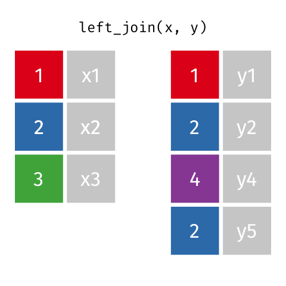

class: center, middle  

```{r xaringan-themer, include=FALSE, warning=FALSE}
library(xaringanthemer)
library(knitr)
library(tidyverse)

style_mono_accent(base_color = "#8B9F84",
                  inverse_link_color = "white")

xaringanExtra::use_panelset()
xaringanExtra::use_clipboard()
```

# bienvenidos!!
.center[Tercera clase de introdución a tidyverse]
[`r icons::fontawesome("link")` saryace.github.io](https://saryace.github.io)
[`r icons::fontawesome("twitter")` @saryace](https://twitter.com/saryace)


---

### Qué vimos la clase anterior?

* Aprender a importar datos
* Entender los datos (tipos y estructuras)
* Revisar si los datos estan limpios
* Aplicar funciones para obtener información (estadísticas básicas)

---
class: left inverse
background-image: url("03_figures/dplyr_wrangling.jpeg")
background-size: contain


.footnote[
[1] [Allison Horst’s Twitter: @allison_horst](https://twitter.com/allison_horst/)
]

---

### Análisis exploratorio de datos (AED)

.center[]


.footnote[
[1] [Figura R4DS](https://r4ds.had.co.nz/explore-intro.html)

[2] [Capítulo en español R4DS](https://es.r4ds.hadley.nz/introducci%C3%B3n.html) 
]

---

### Preguntas de la clase anterior

* `round()` y funciones similares
```{r, eval = FALSE}

numeros_ejemplo <- c(1.1,1.9,-1.1,-1.9)

round(numeros_ejemplo)
ceiling(numeros_ejemplo)
floor(numeros_ejemplo)
trunc(numeros_ejemplo)
signif(numeros_ejemplo, digits = 1)
signif(numeros_ejemplo, digits = 3)

```

---

### Preguntas de la clase anterior

* `round()` y funciones similares

```{r}
numeros_ejemplo <- c(1.1,1.9,-1.1,-1.9)

round(numeros_ejemplo)

ceiling(numeros_ejemplo)

floor(numeros_ejemplo)
```
---

```{r}
numeros_ejemplo <- c(1.1,1.9,-1.1,-1.9)

trunc(numeros_ejemplo)

signif(numeros_ejemplo, digits = 1)

signif(numeros_ejemplo, digits = 3)

```

---

### Preguntas de la clase anterior

* función `str_trim` que remueve espacios

```{r}
df_paises_ejemplo <- data.frame(
  set_1 = c("Chile, Argentina, Bolivia"),
  set_2 = c("Argentina , Chile, Bolivia "))

df_paises_ejemplo

df_paises_ejemplo %>% 
  separate_rows(set_1, set_2, sep = ",") 

```
---

```{r}
df_paises_ejemplo %>% 
  separate_rows(set_1, set_2, sep = ",") %>% 
  mutate(paises_comparacion = set_1 == set_2)
```

```{r}
df_paises_ejemplo %>% 
  separate_rows(set_1, set_2, sep = ",") %>% 
  mutate(set_1 = str_trim(set_1),
          set_2 = str_trim(set_2)) %>% 
  mutate(paises_comparacion = set_1 == set_2)
```

---

class: center middle inverse
.right[Clase de hoy: data wrangling]

---

### Objetivos clase hoy

* Paquetes para tipos de datos específicos
* Formatos de datos (long y wide)
* Uniones de datos 
* Ejercicios data wrangling


---

### una estructura de datos y buena práctica pendiente: `NA`

En R, usamos `NA` cuando corresponde a datos perdidos, mientras que `NULL` corresponde la ausencia de datos

```{r}
mis_mascotas_df <- data.frame(
  "nombre" = c("pepito", "cuchito", "cachupin"), 
  "pulgas" = c(TRUE, FALSE, TRUE),
  "edad" = c(3,11,15),
  "adoptado" = c(TRUE,FALSE,NA))

mis_mascotas_df %>% 
  filter(adoptado == FALSE)
```

para que una fila sea retenia por filter() la condicion debe arrojar `TRUE`
---

### una estructura de datos y buena práctica pendiente: `NA`

En R, usamos `NA` cuando corresponde a datos perdidos, mientras que `NULL` corresponde la ausencia de datos

```{r}
mi_funcion <- function() {
    #sin instrucciones
}

objeto_funcion <- mi_funcion()

objeto_funcion
```


---


### buena práctica pendiente: `NA`

Usar `NA` cuando existan datos perdidos, no otro tipo de dato

```{r}
mis_mascotas_df_opcion_a <- data.frame(
  "nombre" = c("pepito", "cuchito", "cachupin"), 
  "pulgas" = c(TRUE, FALSE, TRUE),
  "edad" = c(3,11,15),
  "adoptado" = c(TRUE,FALSE,NA)) # NA = no se conoce el origen
```

```{r}
mis_mascotas_df_opcion_b <- data.frame(
  "nombre" = c("pepito", "cuchito", "cachupin"), 
  "pulgas" = c(TRUE, FALSE, TRUE),
  "edad" = c(3,11,15),
  "adoptado" = c("adoptado en jornada",
                 "comprado en petshop",
                 "no se sabe"))
```

---

### 

.pull-left[
* dplyr proporciona un set de funciones para la manipulacion de datos más común
* `mutate()` añade nuevas variables que son funciones de variables existentes
* `select()` escoge variables basadas en sus nombres
* `filter()` selecciona los casos en función de sus valores
* `summarise()` reduce los valores múltiples a un solo resumen
* `arrange()` cambia el orden de las filas
* y otras para operaciones condicionales y unión de datos
]

.pull-right[

]

.footnote[
[1] Documentacion [dplyr](https://dplyr.tidyverse.org/)
]

---

### 

.pull-left[
* El objetivo de tidyr es ayudar a crear datos ordenados
* `pivot_longer()` transforma a formato long
* `pivot_wider()` transforma a formato wide
]

.pull-right[

]

.footnote[
[1] Documentacion [tidyr](https://tidyr.tidyverse.org/)
]

---

### Datos tidy rectangulares (ordenados)

* Cada variable forma su propia columna
* Cada observación forma una fila
* Y cada celda es un único valor


.footnote[
[1] R4DS [tidy data](https://r4ds.had.co.nz/tidy-data.html)
]

---

### 

.pull-left[
*  stringr proporciona un conjunto cohesionado de funciones diseñadas para facilitar al máximo el trabajo con strings
* `str_detect()` detecta un patrón de caracteres
* `str_starts()` detecta un patrón de caracteres al inicio
* `str_ends()` detecta un patrón de caracteres al final
* `str_trim()` remueve espacios en blanco del inicio y final
]

.pull-right[

]

.footnote[
[1] Documentacion [stringr](https://stringr.tidyverse.org/)
]

---
### 

.pull-left[
* forcats proporciona herramientas que resuelven problemas comunes con los factores, incluyendo el cambio del orden de los niveles o de los valores. 
* `fct_reorder()` reordena un factor por otra variable
* `fct_infreq()` reordena un factor por la frecuencia de los valores
* `fct_relevel()` cambia el orden de un factor a mano
]

.pull-right[

]

.footnote[
[1] Documentacion [forcats](https://forcats.tidyverse.org/)
]

---

### Formatos long y wide

* El formato “wide” es el formato típico tidy rectangular
* El formato “long” se usa para visualizacion de datos con `ggplot2` 

---

class: middle
background-image: url("03_figures/wide_long.png")
background-size: contain

---

class: middle
background-image: url("03_figures/pivot_wider_longer.gif")
background-size: contain

---

### Uniones de datos: operaciones join

inner_join() fusiona variables de dos conjuntos de datos, pero conserva sólo las filas con un ID común


---

### Uniones de datos: operaciones join

left_join() fusiona variables de dos conjuntos de datos, pero conserva sólo los ID común de la izquierda 


---

### Uniones de datos: operaciones join

right_join() fusiona variables de dos conjuntos de datos, pero conserva sólo los ID común de la derecha


---

### Uniones de datos: operaciones join

full_join() retiene todas las filas de los dos conjuntos de datos de entrada e inserta `NA` cuando falta un ID 


---
### Dataset de hoy: bebidas de starbucks

data: `starbucks.csv`

* Conjunto de datos nutricionales oficiales de Starbucks procedentes de Starbucks Coffee Company Beverage Nutrition Information. 
* La versión en pdf tiene 22 páginas y en este dataset sólo se omitieron los datos de leche vaporizada

.footnote[
[1] Readme [TidyTuesday semana 52](https://github.com/rfordatascience/tidytuesday/blob/master/data/2021/2021-12-21/readme.md)
]

---

### Dataset de hoy: bebidas de starbucks


|variable        |class     |description |
|:---------------|:---------|:-----------|
|Product_Name    |character | Product Name |
|Size            |character | Size of drink (short, tall, grande, venti) |
|Milk            |double    | Milk Type type of milk used
|                |          |  - `0` none
|                |          |  - `1` nonfat
|                |          |  - `2` 2%
|                |          |  - `3` soy
|                |          |  - `4` coconut
|                |          |  - `5` whole |
|Whip            |double    | Whip added or not (binary 0/1) |
|Serv_Size_mL    |double    | Serving size in ml |
|Calories        |double    | KCal|


---


### Dataset de hoy: bebidas de starbucks


|variable        |class     |description |
|:---------------|:---------|:-----------|
|Total_Fat_g     |double    | Total fat grams |
|Saturated_Fat_g |double    | Saturated fat grams |
|Trans_Fat_g     |character | Trans fat grams |
|Cholesterol_mg  |double    | Cholesterol mg |
|Sodium_mg       |double    | Sodium milligrams |
|Total_Carbs_g   |double    | Total Carbs grams |
|Fiber_g         |character | Fiber grams |
|Sugar_g         |double    | Sugar grams  |
|Caffeine_mg     |double    | Caffeine in milligrams |

---

class: left inverse
background-image: url("03_figures/starbucks.png")
background-size: contain

.footnote[
[Georgios Karamani GitHub](https://github.com/gkaramanis/tidytuesday/tree/master/2021/2021-week51)
]


---


class: center middle inverse
.right[Abramos R studio e importemos los datos 💻 ]

---

### Objetivos clase hoy

* Paquetes para tipos de datos específicos
* Formatos de datos (long y wide)
* Uniones de datos 
* Ejercicios data wrangling


---

### Para terminar por hoy, algo divertido
```{r, eval = FALSE}
install.packages("devtools") #instalar primero
devtools::install_github("R-CoderDotCom/calendR") #instalar calendR
```

```{r, eval = FALSE}
library(calendR)
calendR(year = 2022,                             # anio
        title = "Clases tidyverse\n2022",         # titulo
        mbg.col = 2,                             # color de fondo meses
        months.col = "white",                    # color de los meses
        monthnames = c("Enero", "Febrero", "Marzo", "Abril", "Mayo", "Junio", 
                       "Julio", "Agosto", "Septiembre", "Octubre", "Noviembre", "Diciembre"), #meses en espaniol  
        special.days = c(166, 173, 180, 187, 194),   # dias a destacar,
        special.col = "pink",                    # dias especiales
        months.pos = 0.5,                        # alinear al centro los meses
        weeknames = c("L", "M", "W", "J",        # dias de la semana
                      "V", "S","D"), 
        bg.col = "#f4f4f4",                      # color fondo
        start = "M",                             # semana parte lunes
        title.size = 60,                         # tamanio titulo
        orientation = "p")                       # Orientacion
```

---
class: center, middle  

## Nos vemos la próxima semana 🐸

