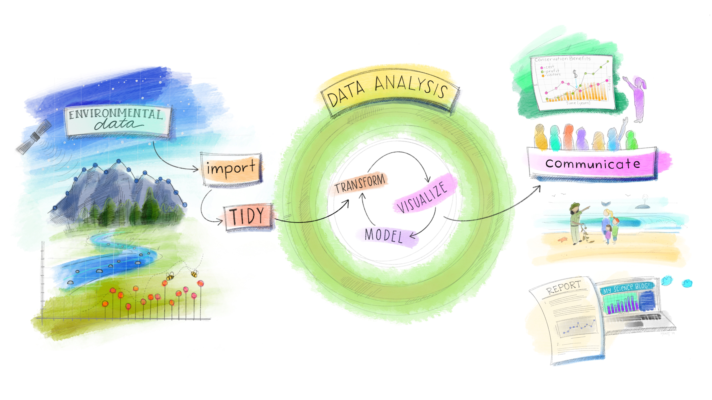
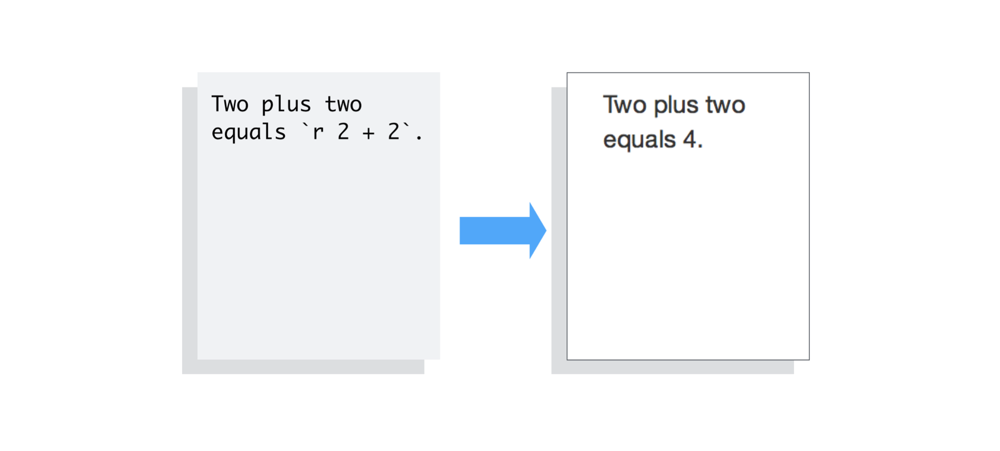

class: center, middle  

```{r xaringan-themer, include=FALSE, warning=FALSE}
library(xaringanthemer)
library(knitr)
library(tidyverse)

style_mono_accent(base_color = "#8B9F84",
                  inverse_link_color = "white")

xaringanExtra::use_panelset()
xaringanExtra::use_clipboard()
```

# bienvenidos!!
.center[Cuarta clase de introdución a tidyverse]
[`r icons::fontawesome("link")` saryace.github.io](https://saryace.github.io)
[`r icons::fontawesome("twitter")` @saryace](https://twitter.com/saryace)

---

### Qué vimos la clase anterior?

* Paquetes para tipos de datos específicos
* Formatos de datos (long y wide)
* Uniones de datos 
* Ejercicios data wrangling

---
class: left inverse
background-image: url("04_figures/ggplot2_art.png")
background-size: contain


.footnote[
[1] [Allison Horst’s Twitter: @allison_horst](https://twitter.com/allison_horst/)
]

---

class: left inverse
background-image: url("04_figures/rmarkdown_wizards.png")
background-size: contain


.footnote[
[1] [Allison Horst’s Twitter: @allison_horst](https://twitter.com/allison_horst/)
]

---

### Análisis exploratorio de datos (AED)

.center[]


.footnote[
[1] [Allison Horst’s Twitter: @allison_horst](https://twitter.com/allison_horst/)
]

---

### Preguntas de la clase anterior

Importar datos de excel a R: readxl

```r
library(readxl)

# Aca usamos una funcion ejemplo para cargar datos
xls_ejemplo <- readxl_example("datasets.xls")

#Usamos la funcion read_excel
read_excel(xls_ejemplo)
```

```
## # A tibble: 150 × 5
##    Sepal.Length Sepal.Width Petal.Length Petal.Width Species
##           <dbl>      <dbl>       <dbl>      <dbl><chr> 
##  1          5.1         3.5          1.4         0.2 setosa 
##  2          4.9         3            1.4         0.2 setosa 
##  3          4.7         3.2          1.3         0.2 setosa 
##  4          4.6         3.1          1.5         0.2 setosa 
##  5          5           3.6          1.4         0.2 setosa 
##  6          5.4         3.9          1.7         0.4 setosa 
##  7          4.6         3.4          1.4         0.3 setosa 
##  8          5           3.4          1.5         0.2 setosa 
##  9          4.4         2.9          1.4         0.2 setosa 
## 10          4.9         3.1          1.5         0.1 setosa 
## # … with 140 more rows
```


---

### Preguntas de la clase anterior

Importar datos de excel a R: readxl

```r
#miramos si tiene hojas
excel_sheets(xls_ejemplo) 
```

```
## [1] "iris"     "mtcars"   "chickwts" "quakes"
```

```r
#leo la hoja que quiero
read_excel(xls_ejemplo, sheet = "iris") 
```

```
## # A tibble: 150 × 5
##    Sepal.Length Sepal.Width Petal.Length Petal.Width Species
##           <dbl>      <dbl>       <dbl>      <dbl><chr> 
##  1          5.1         3.5          1.4         0.2 setosa 
##  2          4.9         3            1.4         0.2 setosa 
##  3          4.7         3.2          1.3         0.2 setosa 
##  4          4.6         3.1          1.5         0.2 setosa 
##  5          5           3.6          1.4         0.2 setosa 
##  6          5.4         3.9          1.7         0.4 setosa 
##  7          4.6         3.4          1.4         0.3 setosa 
##  8          5           3.4          1.5         0.2 setosa 
##  9          4.4         2.9          1.4         0.2 setosa 
## 10          4.9         3.1          1.5         0.1 setosa 
## # … with 140 more rows
```

---

### Preguntas de la clase anterior

Importar datos de excel a R: readxl

```r
# puedo usar rangos
read_excel(xls_ejemplo,
           sheet = "iris",
           range = "A1:B6")
```

```
## # A tibble: 5 × 2
##   Sepal.Length Sepal.Width
##          <dbl>      <dbl&gt;
## 1          5.1         3.5
## 2          4.9         3  
## 3          4.7         3.2
## 4          4.6         3.1
## 5          5           3.6
```
---

### Preguntas de la clase anterior

Importar datos de excel a R: readxl

```r
# puedo usar rangos
read_excel(xls_ejemplo,
           sheet = "iris",
           range = "A1:B6",
           col_types = "text")
```

```
## # A tibble: 5 × 2
##   Sepal.Length       Sepal.Width       
##   <chr>             <chr>            
## 1 5.0999999999999996 3.5               
## 2 4.9000000000000004 3                 
## 3 4.7000000000000002 3.2000000000000002
## 4 4.5999999999999996 3.1000000000000001
## 5 5                  3.6000000000000001
```
---
### Preguntas de la clase anterior

Importar datos de googledrive a R: googlesheets4

```r
library(googlesheets4)

#esto indica que usare links abiertos
gs4_deauth() 

#google sheet publica 
read_sheet("https://docs.google.com/spreadsheets/d/1U6Cf_qEOhiR9AZqTqS3mbMF3zt2db48ZP5v3rkrAEJY/edit#gid=780868077")
```

```
## ✔ Reading from "gapminder".
```

```
## ✔ Range 'Africa'.
```

```
## # A tibble: 624 × 6
##    country continent  year lifeExp      pop gdpPercap
##    <chr>  <chr>    <dbl>  <dbl>   <dbl>    <dbl&gt;
##  1 Algeria Africa     1952    43.1  9279525     2449.
##  2 Algeria Africa     1957    45.7 10270856     3014.
##  3 Algeria Africa     1962    48.3 11000948     2551.
##  4 Algeria Africa     1967    51.4 12760499     3247.
##  5 Algeria Africa     1972    54.5 14760787     4183.
##  6 Algeria Africa     1977    58.0 17152804     4910.
##  7 Algeria Africa     1982    61.4 20033753     5745.
##  8 Algeria Africa     1987    65.8 23254956     5681.
##  9 Algeria Africa     1992    67.7 26298373     5023.
## 10 Algeria Africa     1997    69.2 29072015     4797.
## # … with 614 more rows
```
---
### Preguntas de la clase anterior

Importar datos de google drive a R: googlesheets4

```r
library(googlesheets4)

gs4_auth() # correr en consola y seguir instrucciones

#google sheet privada
read_sheet("https://docs.google.com/spreadsheets/link-privado")
```
---
### Preguntas de la clase anterior

Orden para definir `left_join` o `right_join`

```r
mis_gatos <- data.frame("nombre" = c("cuchito", "minino", 
                                     "bigotito"),
                    "color" = c("negro", "blanco",
                                "atigrado"))

examenes_gato <- data.frame("paciente" = c("cuchito", "minino",
                                           "pedrito",
                                           "rambo","bigotito"),
                    "positivo_pulgas" = c(TRUE,FALSE,TRUE,
                                          FALSE,TRUE))
```

Si quiero crear un nuevo objeto de mis gatos + info de pulgas...

1. Identificar columna ID
2. Operación debe priorizar a `mis_gatos`

---

### Preguntas de la clase anterior

Orden para definir `left_join` o `right_join`


```r
mis_gatos
```

```
##     nombre    color
## 1  cuchito    negro
## 2   minino   blanco
## 3 bigotito atigrado
```

```r
examenes_gato
```

```
##   paciente positivo_pulgas
## 1  cuchito            TRUE
## 2   minino           FALSE
## 3  pedrito            TRUE
## 4    rambo           FALSE
## 5 bigotito            TRUE
```

---

### Preguntas de la clase anterior

Orden para definir `left_join` o `right_join`


```r
mis_gatos %>% left_join(examenes_gato, by=c("nombre"="paciente"))
```

```
##     nombre    color positivo_pulgas
## 1  cuchito    negro            TRUE
## 2   minino   blanco           FALSE
## 3 bigotito atigrado            TRUE
```

```r
examenes_gato %>% right_join(mis_gatos, by=c("paciente"="nombre"))
```

```
##   paciente positivo_pulgas    color
## 1  cuchito            TRUE    negro
## 2   minino           FALSE   blanco
## 3 bigotito            TRUE atigrado
```

```r
examenes_gato %>% anti_join(mis_gatos, by=c("paciente"="nombre"))
```

```
##   paciente positivo_pulgas
## 1  pedrito            TRUE
## 2    rambo           FALSE
```
---
### Preguntas de la clase anterior

Orden para definir `left_join` o `right_join` + `desc(character)`

```r
mis_gatos %>% 
  left_join(examenes_gato, by=c("nombre"="paciente")) %>% 
  arrange(-desc(nombre))
```

```
##     nombre    color positivo_pulgas
## 1 bigotito atigrado            TRUE
## 2  cuchito    negro            TRUE
## 3   minino   blanco           FALSE
```

```r
mis_gatos %>% 
  left_join(examenes_gato, by=c("nombre"="paciente")) %>% 
  arrange(-desc(nombre))
```

```
##     nombre    color positivo_pulgas
## 1 bigotito atigrado            TRUE
## 2  cuchito    negro            TRUE
## 3   minino   blanco           FALSE
```
---

class: left inverse
background-image: url("04_figures/how_much_i_know.jpeg")
background-size: contain


.footnote[
[1] [Allison Horst’s Twitter: @allison_horst](https://twitter.com/allison_horst/)
]

---

### Preguntas de la clase anterior: ayuda!

Como buscar información sobre funciones y errores, considerando que:

.pull-left[
1. R es el peor lenguaje para googlear
2. Vocabulario adecuado de la terminología de R puede ayudar
]

.pull-right[

]
---

### Preguntas de la clase anterior: ayuda!
Los errores clásicos se pueden buscar en google como [R] + mensaje

```r
cafes <- data__frame("nombre" = c("APV","no_APV"),
                           "precio" = c(1500,1750)
cafe$nombre
```

- `Error: unexpected symbol in...`
- `Error: object 'cafe' not found`
- `could not find function "data__frame"`

---

### Preguntas de la clase anterior: ayuda!
Siempre es bueno revisar la documentación de las funciones que queremos usar

- Escribir en la consola `?funcion`, `??funcion` o `help(funcion)` para ir a la ayuda
- Buscar paquete + cheatsheet en google
- Buscar paquete + vignette en google

---

### Preguntas de la clase anterior: ayuda!
- Sé lo que mi código necesita hacer pero no se como escribirlo
- Usar lenguage técnico sobre clases y estructuras de datos ayuda

ejemplo: tengo que extraer los minutos de `duracion_peliculas` 

```r
duracion_peliculas <- c("30 min", "120 min")
class(duracion_peliculas)
```

```
## [1] "character"
```
si busco en google: `extract number from string tidyverse` aparece la funcion `parse_number`

```r
parse_number(duracion_peliculas)
```

```
## [1]  30 120
```

Para mas tips [Teach me how to Google](https://ucsb-meds.github.io/teach-me-how-to-google/#1)
---

### Pendiente: expresiones regulares (regex) 
secuencia de caracteres que define un patrón de búsqueda, principalmente para comparación de strings

```r
estadisticas <- data.frame("nombre" = c("cafe APV","cafe no APV"),
                           "azucar_g_prom" = c(1,3),
                           "azucar_g_min" = c(0.5,0.3),
                           "cafeina_g_prom" = c(0.1,0.3),
                           "cafeina_g_min" = c(0.01,0.03))
estadisticas
```

```
##        nombre azucar_g_prom azucar_g_min cafeina_g_prom cafeina_g_min
## 1    cafe APV             1          0.5            0.1          0.01
## 2 cafe no APV             3          0.3            0.3          0.03
```
---

### Pendiente: expresiones regulares (regex) 
secuencia de caracteres que define un patrón de búsqueda, principalmente para comparación de strings

```r
estadisticas #formato wide
```

```
##        nombre azucar_g_prom azucar_g_min cafeina_g_prom cafeina_g_min
## 1    cafe APV             1          0.5            0.1          0.01
## 2 cafe no APV             3          0.3            0.3          0.03
```


```r
estadisticas %>% #formato long
  pivot_longer(
    cols = !nombre, #todas las columnas excepto nombre
    names_to = c('datos_bebida', '.value'), #nuevas columnas = datos_bebida + .value = prom, min ...
    names_pattern = '(.*)_(\\w+)') # expresion regular para nuevas columnas
```

```
## # A tibble: 4 × 4
##   nombre      datos_bebida  prom   min
##   <chr>      <chr>       <dbl><dbl&gt;
## 1 cafe APV    azucar_g       1    0.5 
## 2 cafe APV    cafeina_g      0.1  0.01
## 3 cafe no APV azucar_g       3    0.3 
## 4 cafe no APV cafeina_g      0.3  0.03
```

---

### Pendiente: expresiones regulares (regex) 

Para más detalle ver [R4DS capítulo strings](https://es.r4ds.hadley.nz/cadenas-de-caracteres.html#cadenas-elementos-b%C3%A1sicos)

el patrón `(.*)_(\\w+)` significa
- `(.*)`  "primer grupo grupo de cero o más caracteres"
- `_` underscore (separador)
- `(\\w+)` "segundo grupo: una palabra"

Esto pondrá todo hasta el último guión bajo en la columna `'datos_bebida'` y los datos restantes se mantienen como el nombre de columna

---
### Expresiones regulares (regex) 
A veces no son muy prácticas: utilizarlas solo cuando sea necesario

```r
estadisticas %>% #formato long
  pivot_longer(
    cols = !nombre, #todas las columnas excepto nombre
    names_to = c('datos_bebida', '.value'), #nuevas columnas = datos_bebida + .value = prom, min ...
    names_pattern = '(.)_(.)') # expresion regular para nuevas columnas
```

```
## # A tibble: 8 × 3
##   nombre      datos_bebida     g
##   <chr>      <chr>       <dbl&gt;
## 1 cafe APV    r             1   
## 2 cafe APV    r             0.5 
## 3 cafe APV    a             0.1 
## 4 cafe APV    a             0.01
## 5 cafe no APV r             3   
## 6 cafe no APV r             0.3 
## 7 cafe no APV a             0.3 
## 8 cafe no APV a             0.03
```
---

class: center middle inverse
.right[Clase de hoy: reportes usando ggplot2 y Rmarkdown]

---

### Objetivos clase hoy

* Familiarizarnos con ggplot2 y Rmarkdown
* Formatos de datos (long y wide)
* Exportar gráficos y tablas a Word y pdf

---

### Familiarizarnos con ggplot2 y Rmarkdown

- RMarkdown: es un formato para crear documentos dinámicos con R. Un documento R Markdown está escrito en markdown (un formato de texto plano) y contiene trozos de código R. 

- ggplot2: es un paquete de R potente y flexible, parte de `tidyverse` para producir gráficos elegantes. El concepto detrás de ggplot2 divide los gráficos en tres componentes: plot = datos + estética + geometría (plot = data + aesthetics + geom)

--- 

### Formatos long y wide

* El formato “wide” es el formato típico tidy rectangular
* El formato “long” se usa para visualizacion de datos con `ggplot2` 

---

class: middle
background-image: url("04_figures/tidyr-pivot_wider_longer.gif")
background-size: contain

---

### `pivot_longer` 

`pivot_longer(cols ="columnas a pivotear (!ID)", names_to: "nombre columna general", values_to: "valores columna general")` 


```r
mis_gatos_pulgas <- data.frame("nombre" = c("cuchito", "minino", 
                                     "bigotito"),
                    "color" = c("negro", "blanco",
                                "atigrado"),
                    "personalidad" = c("arisco","amoroso", "amoroso"))
mis_gatos_pulgas
```

```
##     nombre    color personalidad
## 1  cuchito    negro       arisco
## 2   minino   blanco      amoroso
## 3 bigotito atigrado      amoroso
```
---

### `pivot_longer` 

`pivot_longer(cols ="columnas a pivotear (!ID)", names_to: "nombre columna general", values_to: "valores columna general")` 


```r
mis_gatos_pulgas %>% 
  #cols = c(color,positivo_pulgas),
  pivot_longer(cols = !nombre,# otra forma
               names_to = "caracteristicas_gato",
               values_to = "caracteristica") 
```

```
## # A tibble: 6 × 3
##   nombre   caracteristicas_gato caracteristica
##   <chr>   <chr>               <chr>        
## 1 cuchito  color                negro         
## 2 cuchito  personalidad         arisco        
## 3 minino   color                blanco        
## 4 minino   personalidad         amoroso       
## 5 bigotito color                atigrado      
## 6 bigotito personalidad         amoroso
```

recordemos que R siempre quiere que las columnas sean de solo 1 tipo (clase) de datos
---

### `pivot_wider` 

`pivot_wider(names_from: "columna con nombres", values_from: "columna con valores")` 


```r
mis_gatos_examenes <- data.frame("nombre" = c("cuchito", "minino", 
                                     "bigotito","cuchito", "minino", 
                                     "bigotito"),
                    "examen" = c("colesterol", "colesterol","colesterol",
                                 "glucosa","glucosa", "glucosa"),
                    "valor" = c(1,3,4,2,4,6))
mis_gatos_examenes
```

```
##     nombre     examen valor
## 1  cuchito colesterol     1
## 2   minino colesterol     3
## 3 bigotito colesterol     4
## 4  cuchito    glucosa     2
## 5   minino    glucosa     4
## 6 bigotito    glucosa     6
```
---


### `pivot_wider` 

`pivot_wider(id_cols ="columnas a pivotear (!ID)", names_from: "columna con nombres", values_from: "columna con valores")` 


```r
mis_gatos_examenes %>% 
  pivot_wider(id_cols = nombre,
              names_from = "examen",
              values_from = "valor")
```

```
## # A tibble: 3 × 3
##   nombre   colesterol glucosa
##   <chr>        <dbl>  <dbl&gt;
## 1 cuchito           1       2
## 2 minino            3       4
## 3 bigotito          4       6
```


---

### Uniones de datos + pivot


```r
mis_gatos_pulgas
```

```
##     nombre    color personalidad
## 1  cuchito    negro       arisco
## 2   minino   blanco      amoroso
## 3 bigotito atigrado      amoroso
```

```r
mis_gatos_examenes %>% 
  pivot_wider(id_cols = nombre,
              names_from = "examen",
              values_from = "valor") 
```

```
## # A tibble: 3 × 3
##   nombre   colesterol glucosa
##   <chr>        <dbl>  <dbl&gt;
## 1 cuchito           1       2
## 2 minino            3       4
## 3 bigotito          4       6
```
---
### Uniones de datos + pivot


```r
mis_gatos_examenes %>% 
  pivot_wider(id_cols = nombre,
              names_from = "examen",
              values_from = "valor") %>% 
  inner_join(mis_gatos_pulgas)
```

```
## Joining, by = "nombre"
```

```
## # A tibble: 3 × 5
##   nombre   colesterol glucosa color    personalidad
##   <chr>        <dbl>  <dbl><chr>   <chr>      
## 1 cuchito           1       2 negro    arisco      
## 2 minino            3       4 blanco   amoroso     
## 3 bigotito          4       6 atigrado amoroso
```

---
### `ggplot2`

.pull-left[
- la idea de `ggplot2` es ir agregando capas 
- las más básicas son data + aesthetic + geometry
- `pivot_longer()` + `ggplot` son excelentes amigos


```r
mis_gatos_examenes
```

```
##     nombre     examen valor
## 1  cuchito colesterol     1
## 2   minino colesterol     3
## 3 bigotito colesterol     4
## 4  cuchito    glucosa     2
## 5   minino    glucosa     4
## 6 bigotito    glucosa     6
```

]

.pull-right[

]

---
### `ggplot2`

se compone de tres partes: data + aesthetic + geometry

.pull-left[

```{r plot-1, eval = FALSE}
mis_gatos_examenes <- data.frame("nombre" = c("cuchito", "minino", 
                                     "bigotito","cuchito", "minino", 
                                     "bigotito"),
                    "examen" = c("colesterol", "colesterol","colesterol",
                                 "glucosa","glucosa", "glucosa"),
                    "valor" = c(1,3,4,2,4,6))

mis_gatos_examenes %>% 
  ggplot(aes(x = nombre,
             y = valor,
             color = examen)) +
  geom_point()
```
]

.pull-right[

```{r plot-1-out, ref.label="plot-1", echo=FALSE}
```

]

---
### `ggplot2`

se pueden ir agregando capas de detalle usando `+`

.pull-left[

```{r plot-2, eval = FALSE}
mis_gatos_examenes %>% 
  ggplot(aes(x = nombre,
             y = valor)) +
  geom_point() +
  facet_grid(.~ examen)
```
]

.pull-right[
```{r plot-2-out, ref.label="plot-2", echo=FALSE}
```
]

---

### `ggplot2`

se pueden ir agregando capas de detalle usando `+`

.pull-left[

```{r plot-3, eval = FALSE}
mis_gatos_examenes %>% 
  ggplot(aes(x = nombre,
             y = valor, 
             fill = examen)) +
  geom_col() +
  facet_grid(.~ examen) +
  coord_flip() +
  theme_bw()
```
]

.pull-right[
```{r plot-3-out, ref.label="plot-3", echo=FALSE}
```
]

---

### `ggplot2`

.pull-left[

```{r plot-4, eval = FALSE}
limites <- data.frame(examen = c("colesterol",
                                 "glucosa"),  
                            maximo = c(3,5))
mis_gatos_examenes %>% 
  ggplot(aes(x = nombre,
             y = valor, 
             fill = examen)) +
  geom_col() +
  facet_grid(.~ examen) +                                             
  geom_hline(data = limites,
             aes(yintercept = maximo)) +
  theme_bw()
```
]

.pull-right[
```{r plot-4-out, ref.label="plot-4", echo=FALSE}
```
]

---

### `Rmarkdown`

.pull-left[
- tiene tres componentes: Markdown, R y YAML
- estos componentes se "tejen" 
- YAML define los formatos de salida
]

.pull-right[

]

---
# Sintaxis Rmarkdown

.panelset[

.panel[.panel-name[encabezados]

.pull-left[

```md
# Primer nivel
## Segundo nivel
### Tercer nivel
#### Cuarto nivel
```

].pull-right[

# Primer nivel
## Segundo nivel
### Tercer nivel
#### Cuarto nivel
  
]

]

.panel[.panel-name[texto]

.pull-left[

```md
~~tachado~~
**negrita**
*cursiva*
`.Rmd`
```

].pull-right[

~~tachado~~
**negrita**
*cursiva*
`.Rmd`
]

</br> 

]
.panel[.panel-name[bullets]

.pull-left[

```md
- Elemento 1
- Elemento 2
  - Subelemento 
  - Subelemento 

1. Elemento 1 
2. Elemento 2
```

].pull-right[

- Elemento 1
- Elemento 2
  - Subelemento 
  - Subelemento 

1. Elemento 1 
2. Elemento 2
]

</br> 

]

.panel[.panel-name[imágenes]

.pull-left[

```md

```

].pull-right[
.center[

]
]


]

.panel[.panel-name[tablas]

.pull-left[

```md

Primer encabezado     | Segundo encabezado
--------------------- | ---------------------
Contenido de la celda | Contenido de la celda
Contenido de la celda | Contenido de la celda

```

].pull-right[
.center[

Primer encabezado     | Segundo encabezado
--------------------- | ---------------------
Contenido de la celda | Contenido de la celda
Contenido de la celda | Contenido de la celda

]
]


]

.panel[.panel-name[links]

.pull-left[

```md
[R4DS Rmarkdown](https://es.r4ds.hadley.nz/r-markdown.html)
```

].pull-right[

[R4DS Rmarkdown](https://es.r4ds.hadley.nz/r-markdown.html)
]

</br> 

]

]


---

### Dataset de hoy: bebidas de starbucks

data: `starbucks.csv`

* Conjunto de datos nutricionales oficiales de Starbucks procedentes de Starbucks Coffee Company Beverage Nutrition Information. 
* La versión en pdf tiene 22 páginas y en este dataset sólo se omitieron los datos de leche vaporizada

.footnote[
[1] Readme [TidyTuesday semana 52](https://github.com/rfordatascience/tidytuesday/blob/master/data/2021/2021-12-21/readme.md)
]

---

### Dataset de hoy: bebidas de starbucks


|variable        |class     |description |
|:---------------|:---------|:-----------|
|Product_Name    |character | Product Name |
|Size            |character | Size of drink (short, tall, grande, venti) |
|Milk            |double    | Milk Type type of milk used
|                |          |  - `0` none
|                |          |  - `1` nonfat
|                |          |  - `2` 2%
|                |          |  - `3` soy
|                |          |  - `4` coconut
|                |          |  - `5` whole |
|Whip            |double    | Whip added or not (binary 0/1) |
|Serv_Size_mL    |double    | Serving size in ml |
|Calories        |double    | KCal|


---

### Dataset de hoy: bebidas de starbucks


|variable        |class     |description |
|:---------------|:---------|:-----------|
|Total_Fat_g     |double    | Total fat grams |
|Saturated_Fat_g |double    | Saturated fat grams |
|Trans_Fat_g     |character | Trans fat grams |
|Cholesterol_mg  |double    | Cholesterol mg |
|Sodium_mg       |double    | Sodium milligrams |
|Total_Carbs_g   |double    | Total Carbs grams |
|Fiber_g         |character | Fiber grams |
|Sugar_g         |double    | Sugar grams  |
|Caffeine_mg     |double    | Caffeine in milligrams |

---


class: center middle inverse
.right[Abramos R studio e importemos los datos 💻 ]

---

### Objetivos clase hoy

* Familiarizarnos con ggplot2 y Rmarkdown
* Formatos de datos (long y wide)
* Exportar gráficos y tablas a Word y pdf

---

### Para terminar por hoy, algo divertido


```r
install.packages("gm") #instalar
```
instalar [MuseScore](https://musescore.org/en)
una vez instalado `gm`, reiniciar Rstudio y luego correr el siguiente código

```r
library(gm)

musica <- Music()

musica <- m +
  # agregar 4/4 tiempos
  Meter(4, 4) +
  # agregar linea
  Line(pitches = list("C5"), durations = list("whole"))

show(musica , to = c("score", "audio")) #ver archivo musica
```
---
class: center, middle  

## Nos vemos la próxima semana 🐸