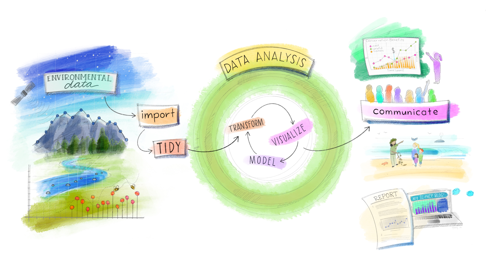
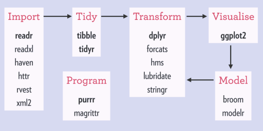
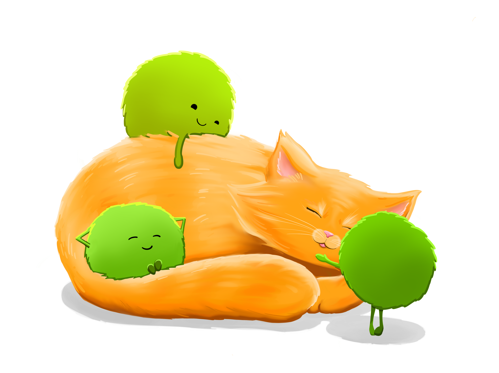

class: center, middle  

```{r xaringan-themer, include=FALSE, warning=FALSE}
library(xaringanthemer)
library(knitr)
library(tidyverse)

style_mono_accent(base_color = "#8B9F84",
                  inverse_link_color = "white")

xaringanExtra::use_panelset()
xaringanExtra::use_clipboard()
```

# bienvenidos!!
.center[Quinta clase de introdución a tidyverse]
[`r icons::fontawesome("link")` saryace.github.io](https://saryace.github.io)
[`r icons::fontawesome("twitter")` @saryace](https://twitter.com/saryace)

---

### Qué vimos la clase anterior?

* Familiarizarnos con ggplot2 y Rmarkdown
* Formatos de datos (long y wide)
* Exportar gráficos y tablas a Word y pdf

---

### Qué veremos hoy?

* Iteración, loops y funciones
* Paquete `purrr`
* Modelo linear simple

---
class: left inverse
background-image: url("05_figures/for_loop.jpeg")
background-size: contain


.footnote[
[1] [Allison Horst’s Twitter: @allison_horst](https://twitter.com/allison_horst/)
]

---

class: left inverse
background-image: url("05_figures/purrr.png")
background-size: contain


.footnote[
[1] [Allison Horst’s Twitter: @allison_horst](https://twitter.com/allison_horst/)
]

---

### Análisis exploratorio de datos (AED)

.center[]


.footnote[
[1] [Allison Horst’s Twitter: @allison_horst](https://twitter.com/allison_horst/)
]

---

### Preguntas de la clase anterior

Una revisión de expresiones regulares y como usar `stringr`
**patrón al final de una palabra**

```{r}
mis_gatos <- c("uma", "cuchito", "michito")

str_view(mis_gatos, "ito$")

```

---

### Preguntas de la clase anterior

Una revisión de expresiones regulares y como usar `stringr`
**patrón al inicio de una palabra**

```{r}
mis_gatos <- c("uma", "cuchito", "michito")

str_view(mis_gatos, "^u") 

```

---

### Preguntas de la clase anterior

Una revisión de expresiones regulares y como usar `stringr`
**patrón en "sandwich" de una palabra**

```{r}
mis_gatos <- c("uma", "cuchito", "michito")

str_view(mis_gatos, ".chi.") 

```

---

### Preguntas de la clase anterior

`stringr` tiene funciones que reemplazan las regex más comunes

- str_ends()
- str_starts()
- str_contains()

---

### Preguntas de la clase anterior

`stringr` a veces no es suficiente y regex es requerido

```{r}
rut <- c("92.580.000-7", "5.555.555-5", "5555555-5",
         "12.345.678-K","12.345.678-k")

regex_rut <- "^([0-9]{1,3}(?:\\.[0-9]{1,3}){2}-[[0-9]kK])$"

# ^([0-9]{1,3} al inicio de 1 a 3 digitos
# (?:\\.[0-9]{1,3}){2} dos set de un punto + 1 a 3 digitos no agrupados
# - separador
# [[0-9]kK])$ cualquiera de lo siguiente: digito, k o K al final


```

.footnote[
[1] [Ejemplo regex adaptado desde regexlib](https://www.regexlib.com/REDetails.aspx?regexp_id=1597)
]

---

### Preguntas de la clase anterior

`stringr` a veces no es suficiente y regex es requerido

```{r}
rut <- c("92.580.000-7", "5.555.555-5", "5555555-5",
         "12.345.678-K","12.345.678-k")

regex_rut <- "^([0-9]{1,3}(?:\\.[0-9]{1,3}){2}-[[0-9]kK])$"
  
str_view(rut, regex_rut)

```

.footnote[
[1] [Ejemplo regex adaptado desde regexlib](https://www.regexlib.com/REDetails.aspx?regexp_id=1597)
]

---
### Preguntas de la clase anterior

Cuando usar cada paquete?

.center[]

.footnote[
[1] [Old school vs. tidyverse](https://germangfeler.github.io/datascience/old-school-vs-tidy/)
]


---

### Cuando usar `purrr`

.pull-left[
- Leer varios archivos a la vez
- Trabajar con listas
- Transformar datos a datos rectangulares
]

.pull-right[

]

.footnote[
[1] [Allison Horst’s Twitter: @allison_horst](https://twitter.com/allison_horst/)
[2] [RStudio Education](https://education.rstudio.com/blog/2020/07/teaching-the-tidyverse-in-2020-part-4-when-to-purrr/)
]
---

### Recordemos que es una lista

- Dataframes y tibbles pueden guardar diferentes tipos de datos en columnas

- Las listas permiten contener cosas como dataframes, matrices y vectores en una misma variable.

.panelset[

.panel[.panel-name[crear una lista]

.pull-left[

```{r}
trencito <- list(1:3, "a", 4:6)

```

].pull-right[

.center[]
  
]

]

.panel[.panel-name[trencito]

.pull-left[

```{r}
trencito <- list(1:3, "a", 4:6)

trencito[1]

trencito[[1]]
```

].pull-right[

.center[]
  
]

</br> 

]

.panel[.panel-name[extraer elementos]

.pull-left[

```r
trencito[1:2]

trencito[-2]

trencito[c(1,1)]

trencito[0]
```

].pull-right[

.center[]
  
]

</br> 


]

]

---

### Vamos a crear un vector y una función

```{r}

uno_al_diez <- c(1:10)

por_diez <- function(x) x*10

```

### ahora vamos a aplicar la función al vector

```{r}


uno_al_diez_por_diez <- por_diez(uno_al_diez)

uno_al_diez_por_diez

```

---

### Vamos a crear una lista

```{r}

uno_al_diez_lista <- list("numeros" = 1:10)

uno_al_diez_lista 

```

### ahora vamos a aplicar la función a la lista

```{r eval = FALSE}


uno_al_diez_por_diez_lista <- por_diez(uno_al_diez_lista)

uno_al_diez_por_diez_lista

```

**Error in x * 10 : non-numeric argument to binary operator**

---

class: middle

.center[#las funciones vectoriales no funcionan en las listas :(]

---

### función base de `purrr`: `map()`


`map()` recibe como argumentos un vector, una lista o un data frame + una función y aplica dicha función a cada elemento devolviendo el resultado en una lista


.center[]
  
---


### función base de `purrr`: `map()`

.pull-left[

- Vector: `map()` aplicará la funció a cada elemento del vector

- Lista:  `map()` aplicará la función a cada elemento de la lista

- dataframe: `map()` aplicará la función a cada columna del dataframe


].pull-right[

.center[]
  
]

.footnote[
[1] [Introducción a la programación funcional con purrr](https://albertoalmuinha.com/es/posts/2021-03-11-purrr/purrr-es/)
]


---

### Veamos unos ejemplos sencillos: `map()` + vector
```{r}

por_diez <- function(x) x*10

purrr::map(uno_al_diez, por_diez)

```

---

### Veamos unos ejemplos sencillos: `map_dbl()` + vector
```{r}

purrr::map_dbl(uno_al_diez, por_diez)

```

--- 

### Veamos unos ejemplos sencillos: `map()` + lista

```{r}

por_diez <- function(x) x*10

purrr::map(uno_al_diez_lista, por_diez)
```

---

### función base de `purrr`: `map2()`

`map2()`toma como input una función y la aplica a cada par de elementos (dos vectores o  dos listas)

```{r}
dataset_a <- c(3, 2 ,1)
dataset_b <- c(1, 2, 3)

sumar_filas <- function(x, y) {x+y}

purrr::map2_dbl(dataset_a, dataset_b, sumar_filas)

```
---

### Saludos estilo R base
```{r}
saludo_curso <- function(nombre) {
  paste("hola", nombre)
}
nombres_clase <- c("Felipe",  "Pedro",  "Victo" , "Ximena",
                    "Olivier",  "Valentina")
for (estudiantes in nombres_clase) {
  print(saludo_curso(estudiantes))
}
```

---

### Saludos estilo purrr + `map()`
```{r}
saludar_curso <- function(.nombres_clase) {message(paste('hola ', .nombres_clase))}
nombres_clase <- c("Felipe",  "Pedro",  "Victo" , "Ximena",
                    "Olivier",  "Valentina")

purrr::map(nombres_clase, saludar_curso)

```
---

### Saludos estilo purrr + `walk()`
```{r}
saludar_curso <- function(.nombres_clase) {message(paste('hola ', .nombres_clase))}
nombres_clase <- c("Felipe",  "Pedro",  "Victo" , "Ximena",
                    "Olivier",  "Valentina")

purrr::walk(nombres_clase, saludar_curso)

```
---

### Dataset de hoy: palmerpenguins

data: `library(palmerpenguins)`

* Contiene dos datasets: `penguins` y `penguins_raw`
* Ambos datasets contienen datos de 344 pingüinos. Hay 3 especies diferentes de pingüinos, recogidos en 3 islas del archipiélago de Palmer, en la Antártida.

.footnote[
[1] [Palmerpenguins](https://github.com/allisonhorst/palmerpenguins)
]

---

.center[]

---

.center[]

---

class: center middle

.center[##descansemos 10 minutos sin pantallas 💻 🚫]

```{r,echo=FALSE}
countdown::countdown(minutes = 10)
```

---


class: center middle inverse
.right[Abramos R studio e importemos los datos 💻 ]

---

### Objetivos clase hoy

* Iteración, loops y funciones
* Paquete `purrr`
* Modelo linear simple

---

### Para terminar por hoy, algo divertido

```r
# install.packages("DataExplorer")
# install.packages("palmerpenguins")

library(DataExplorer)
library(palmerpenguins)

data(package = 'palmerpenguins')

create_report(penguins)

```
---
class: center, middle  

## gracias por tu atención 🐸